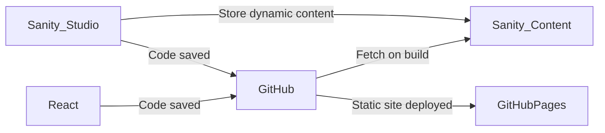
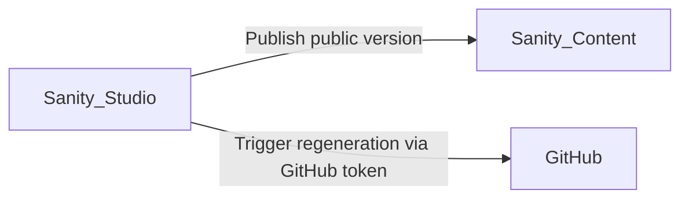
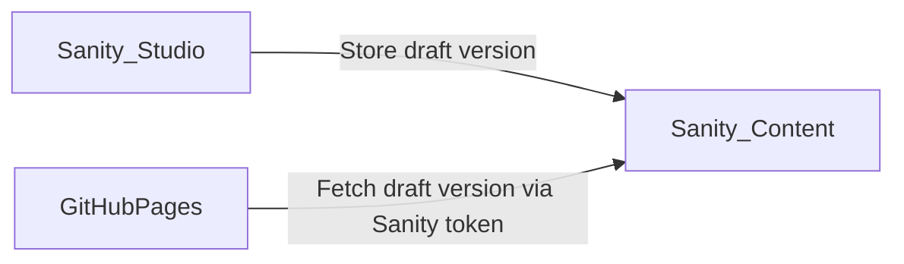

# Static site deployment example

The goal was to have a cheap to maintain representative WebSite.
Ideally, with the benefits of fast feedback when developing locally, updating content on holiday.
Ideally, having extension points when the site would scale.

## Architecture

Main components:



Deployment flow:



Preview flow:



## Local development

```bash
nvm use
yarn
yarn dev
```

Open [http://localhost:3000](http://localhost:3000)

## Static version

```bash
yarn build
yarn export
yarn view
```

Proxies `/out` via [http://127.0.0.1:8080](http://127.0.0.1:8080)

## Deployment

- Merge to `main`
- Github actions would [build](.github/workflows/build.yml) and [deploy](.github/workflows/deploy.yml)

Open [https://www.baneliene.lt/](https://www.baneliene.lt/)

## Content management

[https://baneliene-lt.sanity.studio/](https://baneliene-lt.sanity.studio/)

Which is generated via code in [`cms`](./cms/README.md) folder:

```bash
cd cms/
yarn
yarn dev
yarn build
yarn deploy
```

## References

- [GitHub Pages](https://pages.github.com/) - static site hosting
- [Next.js Documentation](https://nextjs.org/docs) - learn about Next.js features and API.
- [Learn Next.js](https://nextjs.org/learn) - an interactive Next.js tutorial.
- [getStaticProps](https://nextjs.org/docs/basic-features/data-fetching/get-static-props) - compile time execution
- [TailWindCSS](https://tailwindcss.com/docs/editor-setup) – tools for Styling
- [Sanity](https://www.sanity.io) - headless CMS
- [Heroicons](https://heroicons.com/) - SVG icons
